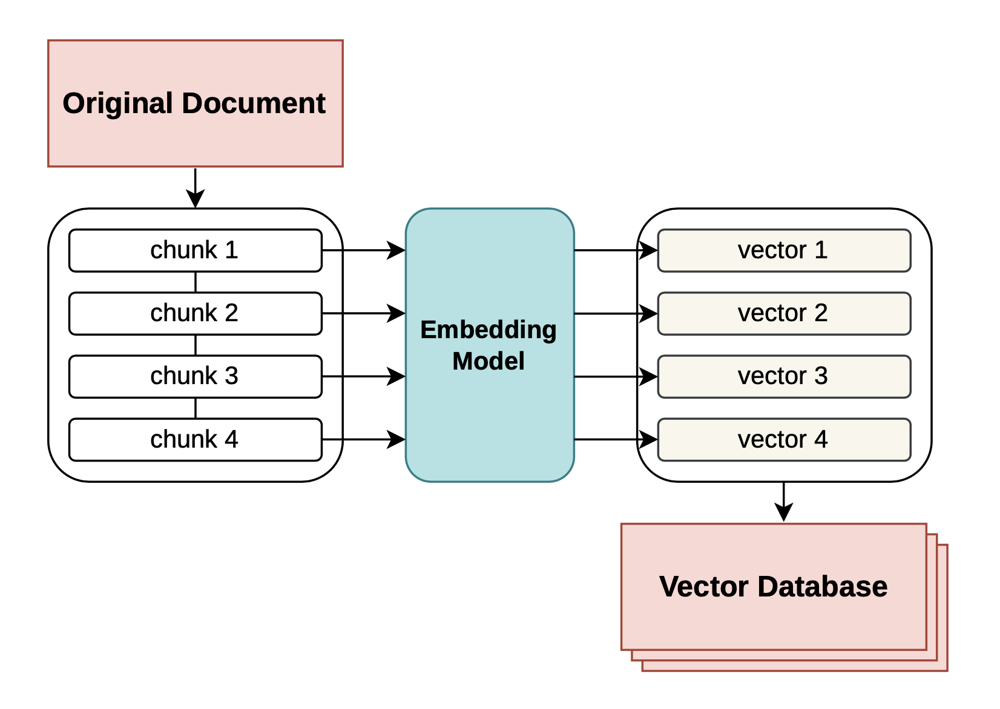
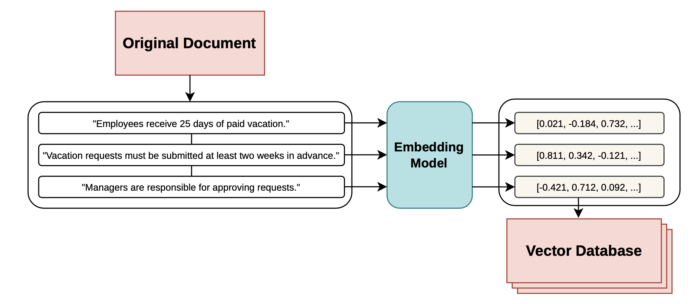
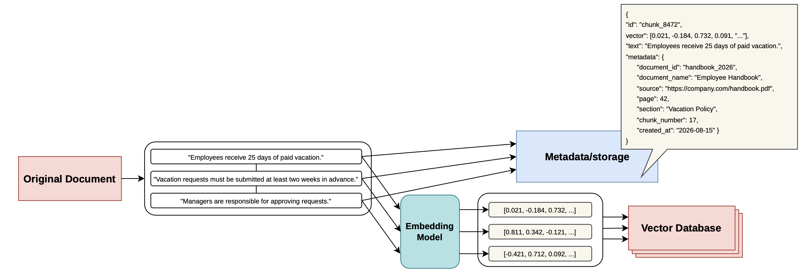
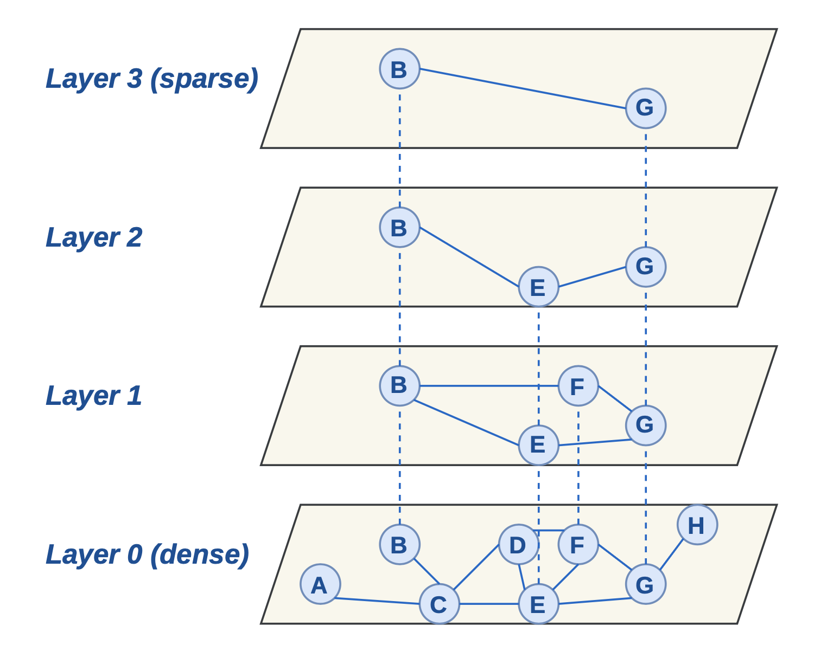
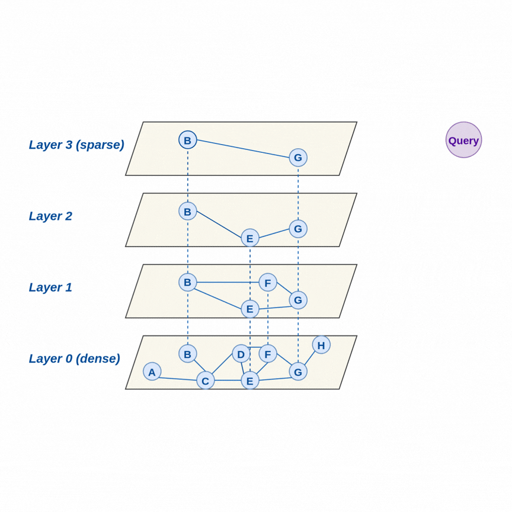

A RAG vector database is a specialised storage system designed to help AI **retrieve information based on semantic meaning** rather than relying solely on keyword matching. Vector databases have become increasingly important in AI applications because they store information as **numerical vectors** that capture semantic relationships, enabling machine learning models to efficiently perform similarity searches and retrieve relevant information.

There are three core functions in relation with RAG vector database and in this post I will speak in a more detail about each of them:
- Vector storage
- Vector indexing
- Vector search

**VECTOR STORAGE**

= vector embeddings with metadata.The vector is generated from some piece of text (or other data), but that piece does not have to be a whole document. In practice, RAG systems usually split documents into chunks, and generate **one embedding vector per chunk**.

Think of the pipeline like this:

Suppose there is a document:

<code>Company Vacation Policy</code>

<code>Employees receive 25 days of paid vacation per year. Vacation requests must be submitted at least two weeks in advance. Managers are responsible for approving requests.</code>

One can generate a single vector for the entire document. But that's usually not ideal. Instead, it can be split into chunks:

<code>Company Vacation Policy</code>

<code>[Employees receive 25 days of paid vacation per year]. [Vacation requests must be submitted at least two weeks in advance]. [Managers are responsible for approving requests].</code>

The embedding model takes each chunk as input:

That array of numbers is the **embedding vector**. The vector isn't manually created by the RAG developer. It's produced by an **embedding model**, which has been trained to map semantically related pieces of information to nearby locations in a high-dimensional mathematical space.

There's no universal chunk size. Chunks can be of ~200–1,000 tokens, sometimes with overlap between neighbouring chunks. For example, *"apple"* VS *"Apple released a new MacBook yesterday."*
The second contains contextual information that is useful for retrieval. A sentence or paragraph gives the embedding model much more semantic context. So typically:

**Important:** the original text is stored separately alongside the vector. Thus, typical RAG system looks like this:

Where embeddings are created for finding information efficiently and original text is kept for giving information to the LLM.

**OPTIMIZATION: VECTOR INDEXING**
Vector indexing transforms vectors into data structures that allow faster similarity or distance searches. Typically, **approximate nearest-neighbour (ANN) search** methods are used to avoid computing similarity between all the vectors every time when a query comes.
One of the most widely used ANN algorithms is **Hierarchical Navigable Small World (HNSW)**. HNSW is an index that is built and maintained as the vector collection changes. HNSW builds a hierarchical, multi-layer graph where every vector exists at the bottom layer, while a progressively smaller subset of vectors is promoted to higher layers to provide long-range navigation:

How does HNSW choose which nodes go into upper layers? **Nodes are assigned to levels probabilistically**. When a vector is inserted, HNSW essentially randomly determines how high that vector will appear in the hierarchy. Every node exists at **level 0**, but only some nodes are promoted to level 1, fewer to level 2, fewer still to level 3, etc.The important thing is that the upper layers aren't deliberately selected because they are "important" or "central" vectors.

**RAG VECTOR SEARCH**
When the user submits a query, it is converted into a vector and used to perform a similarity search to identify the most relevant documents or chunks. HNSW significantly optimises this search by exploring only a subset of the available vectors rather than comparing the query against every vector in the database. This greatly reduces the number of distance calculations and is particularly important when working with large vector databases.

The HNSW algorithm starts its search at the top layer, where it compares the query vector with the current node and its neighbouring nodes. It then moves toward increasingly closer candidates and, once the search at that layer is complete, descends to the next layer, continuing the search from the best candidate found so far and exploring its neighbours. This process is repeated until the algorithm reaches the bottom layer, where it performs a more detailed search among the nearest candidates:

The query vector is compared to the database vectors either by calculating their similarity or with a distance metric. The choice of the metric for a RAG vector database depends entirely on the embedding model used to create the text vectors: **the vector database metric should match to the metric the embedding model was trained on**.
The most widely used metrics are:

**Dot product** (efficient). Embedding models like those from OpenAI (text-embedding-3-small, text-embedding-ada-002), Cohere, Hugging Face transformers produce unit-normalised vectors (vectors with a length/magnitude of 1). In this case, it is recommended to use dot product metric. When vectors are normalised to a length of 1, the dot product is mathematically identical to cosine similarity. However, because it avoids the extra math required to calculate vector lengths during search, the dot product is computationally faster and cheaper to run in production.

**Cosine Similarity** (good for unnormalised data). Cosine similarity completely ignores document length and focuses purely on the "angle" (the semantic meaning). If embedding model does not automatically normalise vectors, dot product will incorrectly favour longer text chunks simply because they have more words. Cosine similarity avoids this bias.

**Euclidean Distance** (rarely the first choice for RAG). When vectors are normalised, Euclidean distance becomes directly related to cosine similarity. If all vectors lie on the unit sphere, a smaller Euclidean distance corresponds to greater angular similarity. Euclidean distance can be useful when the vectors’ absolute positions or magnitudes matter, rather than only their angular alignment. However, for many unnormalised text embeddings, Euclidean distance can be more sensitive to differences in vector magnitude than the retrieval task requires.

**Jaccard similarity** (rarely used). Rarely used for primary vector search because it only looks for exact word matches and ignores the semantic relationships. However, it is often useful in Hybrid Search systems to filter or rank keyword frequencies before or after the semantic vector search phase.

**CONCLUSION**

Vector database provides an efficient way to store, index, and retrieve high-dimensional vector representations based on semantic similarity, even at large scale. The main advantages of vector databases:
- semantic search
- fast similarity search at scale
- metadata filtering
- scalability
- dynamic updates

**BIBLIOGRAPHY**
1. Gao, Yunfan, Yun Xiong, Xinyu Gao, Kangxiang Jia, Jinliu Pan, Yuxi Bi, Yi Dai, Jiawei Sun, Meng Wang, and Haofen Wang. "Retrieval-augmented generation for large language models: A survey." arXiv preprint arXiv:2312.10997 (2023).
2. Lin, Yanjun, Kai Zhang, Zhenying He, Yinan Jing, and X. Sean Wang. "Survey of filtered approximate nearest neighbor search over the vector-scalar hybrid data." arXiv preprint arXiv:2505.06501 (2025).
3. Wang, Zeyu, Peng Wang, Themis Palpanas, and Wei Wang. "Graph-and Tree-based Indexes for High-dimensional Vector Similarity Search: Analyses, Comparisons, and Future Directions." IEEE Data Eng. Bull. 47, no. 3 (2023): 3-21.
